# 소감
### 남수지 : 매일 교수님을 따라 수업을 진행하면서 배우는 것 보다 실습 안내서를 받아서 실습을 하는 것이 따라가기 쉽고 좋다고 느껴졌습니다. 그리고 이번 과제에서 팀을 정할 때 lms를 사용하여 저희에게 선택지를 주신것이 매우 좋았습니다. 매번 새로운 수업 방법을 생각해서 와주시는 교수님께 감동 받았습니다. 
### 하지영 : 오늘 새로운 멀티테스킹과 OnIdle()활용을 배워 재미있고 즐거웠습니다. 수업시간에 잘 따라가지 못하는 저희를 위해 실습 안내서를 내주신 교수님께 감동 받았습니다. 

## 방법
1.   
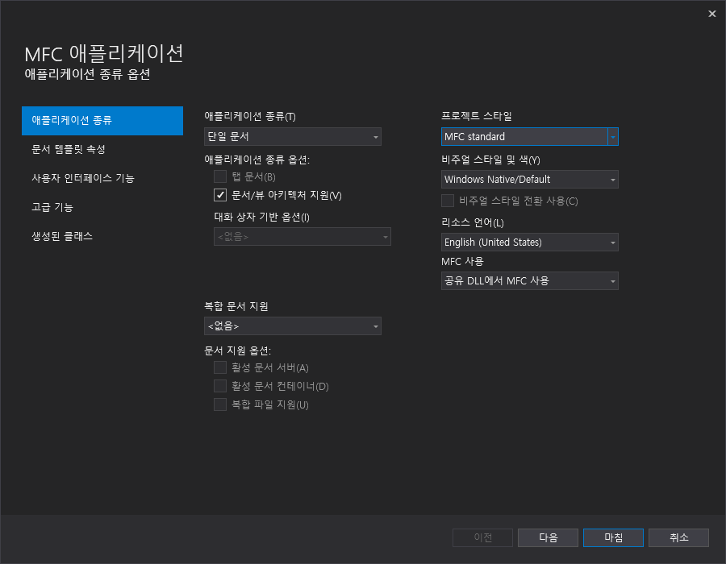  
2.  
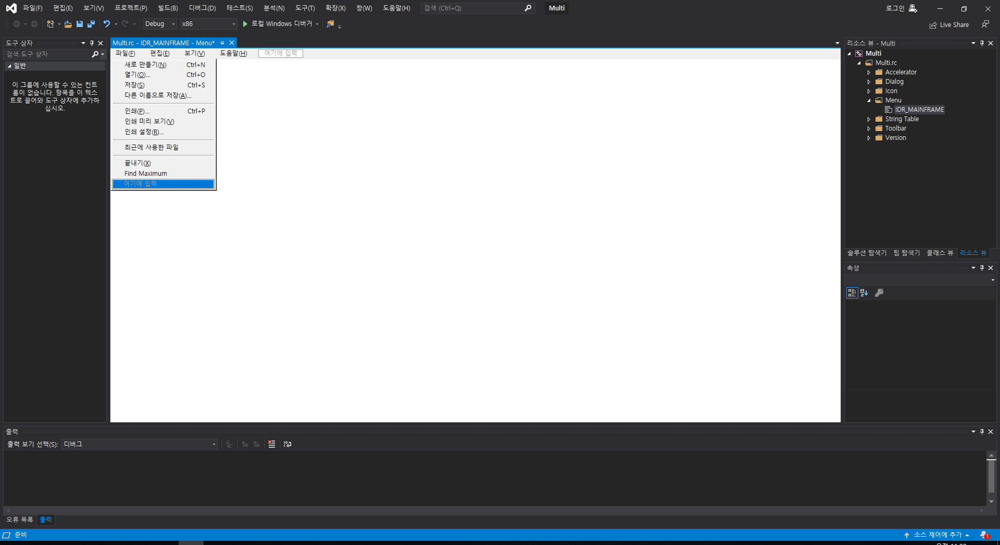  
3.  
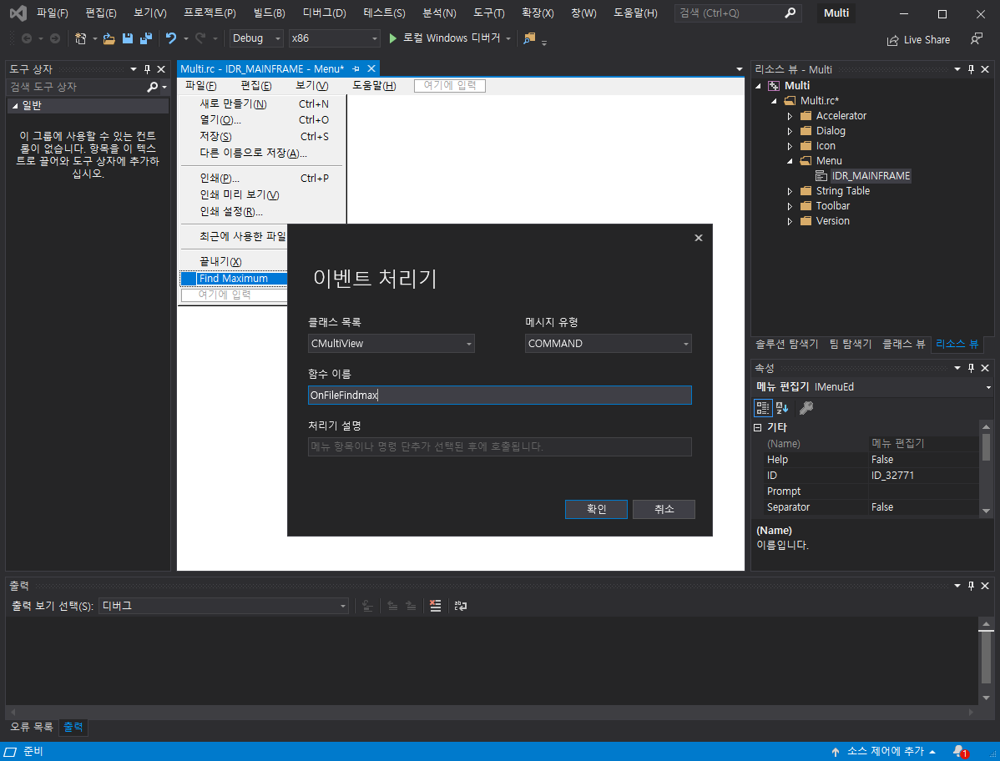  
4.  
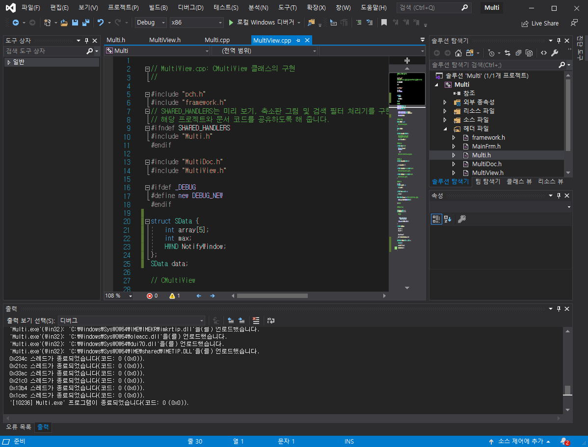  
5.  
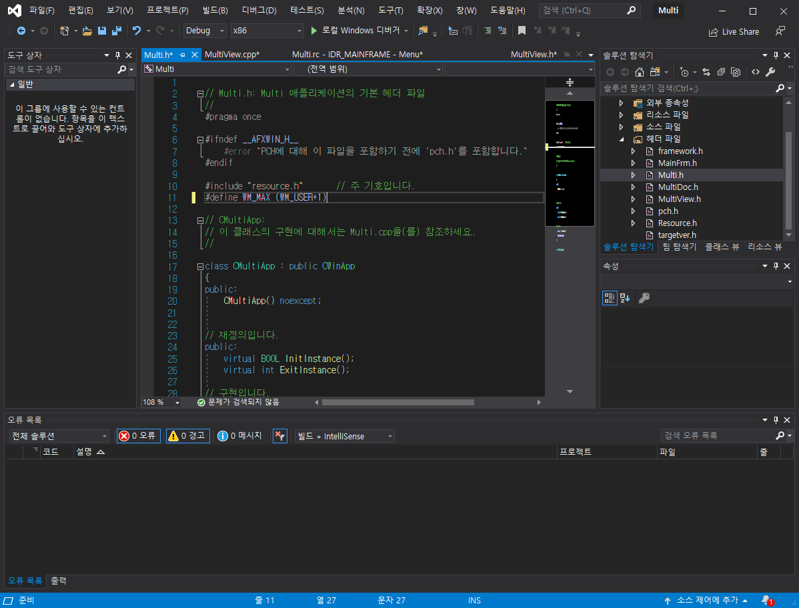  
6.
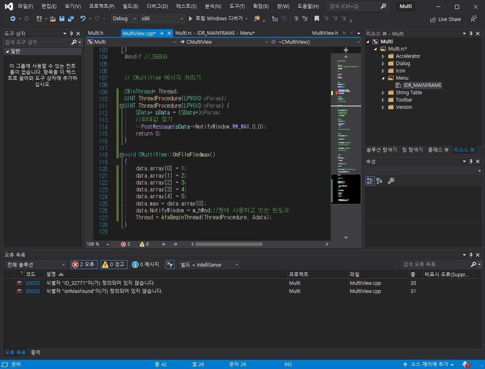  
7.
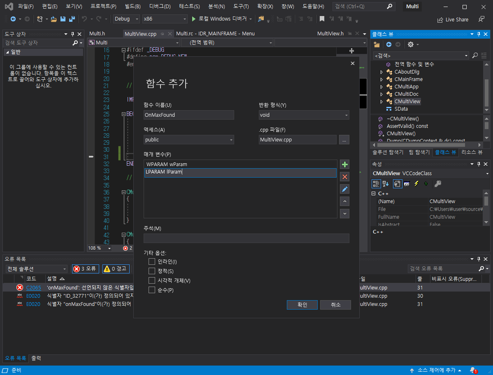  
8.
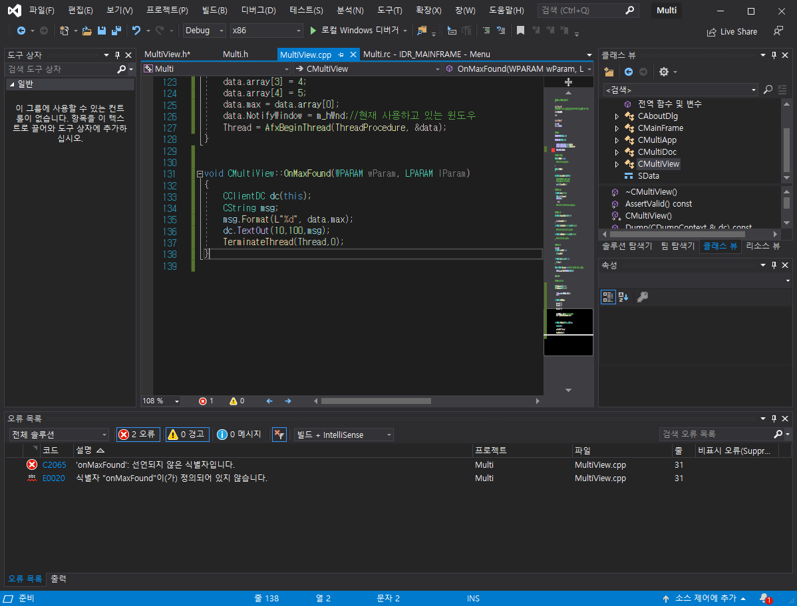  
9.
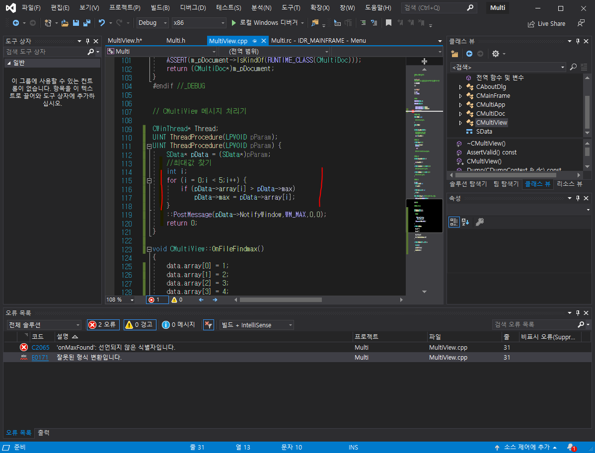
10. 
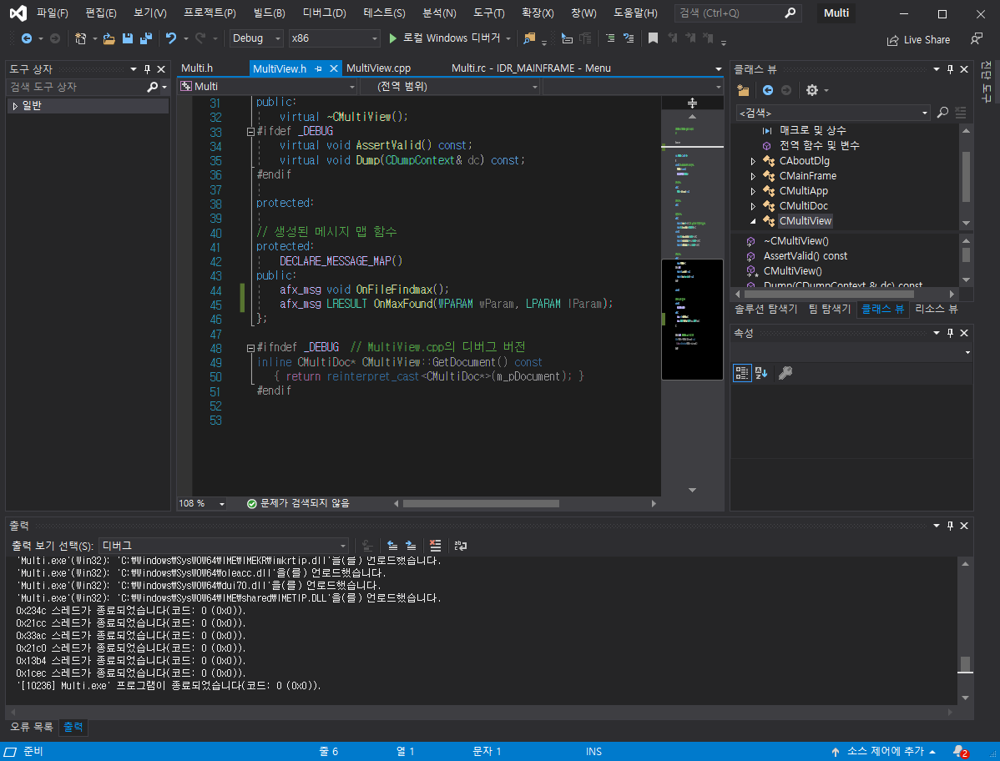
11.  
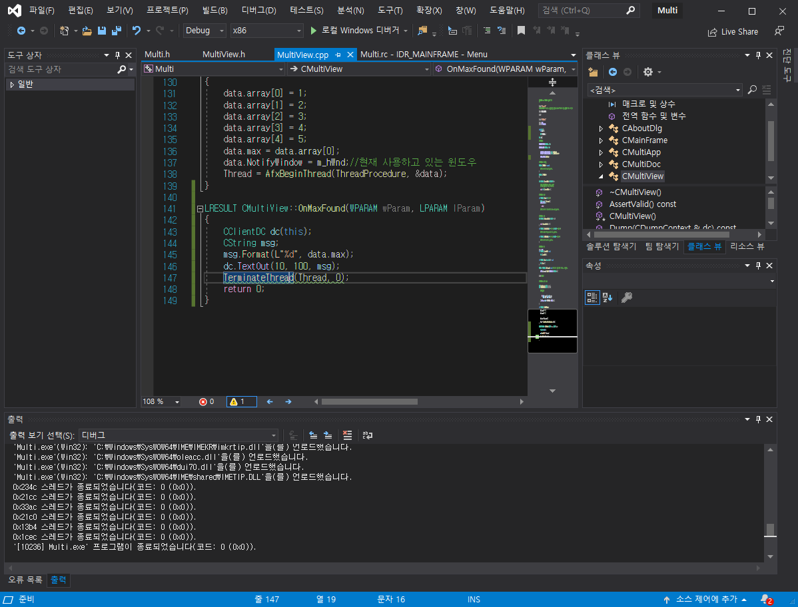

# RESULT  
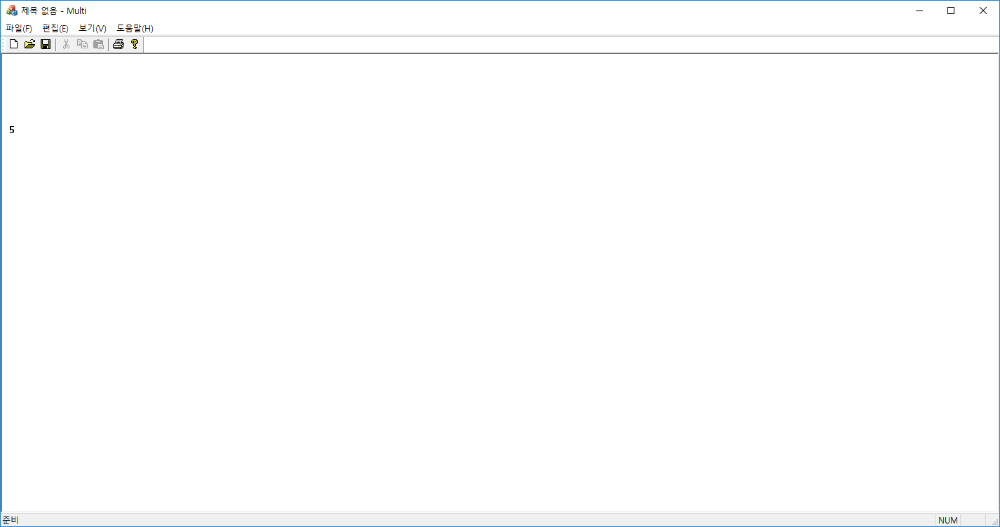
